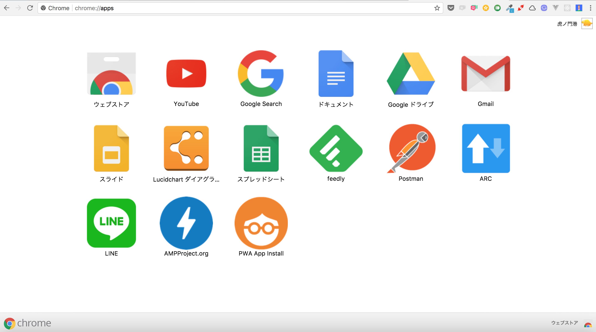

# app-install
This is a sample of Progressive Web Apps with app install feature.

## Getting started
This project requires Docker. Install from [here](https://docs.docker.com/engine/installation/#supported-platforms).

### Access page
Run the following command.

```

$ docker-compose up --build -d

```

Access in the browser by navigating to ```http://localhost:3000```.

### App install
When access the page, install banner will be shown on top at screen. When click button on the banner, the application will be installed to Chrome apps.
For mobile browsers, the application will be installed on the home screen.


