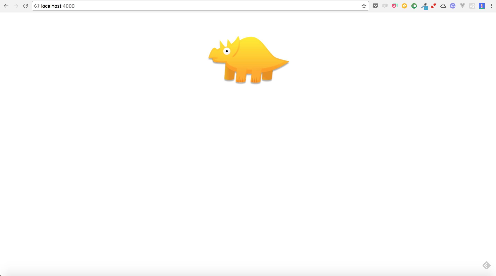
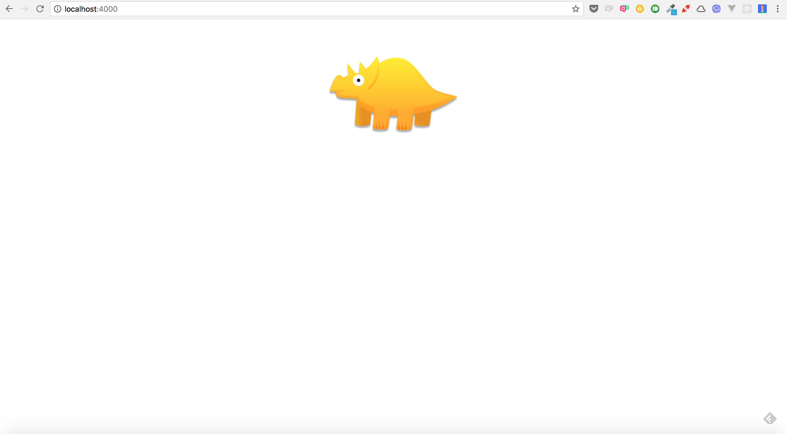

# cache
This is a sample of Progressive Web Apps that caches URL addressable resources such as HTML, CSS, JavaScript.

## Getting Started
This project requires Docker. Install from [here](https://docs.docker.com/engine/installation/#supported-platforms).

### Access page
Run the following command.

```

$ docker-compose up --build -d

```

Access in the browser by navigating to ```http://localhost:4000```.

### Working offline
Access the page at ```http://localhost:4000```.



Take your PC offline and reload the page again. The page is shown even if PC is offline.

