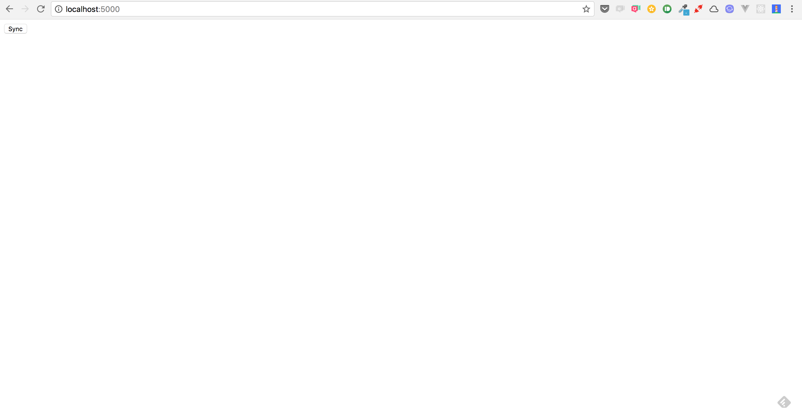
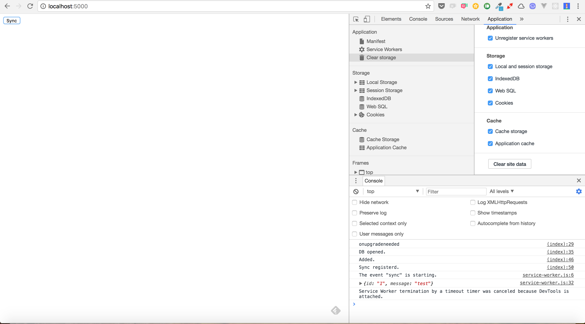

# sync
This is a sample of Progressive Web Apps with background sync feature.

## Getting Started

### Install tools
This project requires [Docker](https://docs.docker.com/engine/installation/#supported-platforms) and [minikube](https://kubernetes.io/docs/tasks/tools/install-minikube/).

### Minikube settings

Create a namespace:

```

cd app/
kubectl create -f namespace.yaml

```

Generate your self-signed certificate:

```

mkdir tls
cd tls/
sudo openssl req -x509 -nodes -days 365 -newkey rsa:2048 -keyout tls.key -out tls.crt -subj "/CN=app-sync.minikube.test"

```

Create a secret for your self-signed certificate:

```

kubectl create secret tls app-sync --key tls.key --cert tls.crt --namespace=samples-app-sync

```

Create a persistent volume and a persistent volum claim:

```

cd ../
kubectl create -f pv.yaml
kubectl create -f pvc.yaml

```

Push a docker image of this app to docker registry on minikube:

```

eval $(minikube docker-env)
docker build -t app-sync:0.1 .

```

Make sure that the image is pushed:

```

doccker images

```

Create a service for nginx and an ingress for it:

```

minikube addons enable ingress
kubectl create -f app-sync.yaml
kubectl create -f ingress.yaml

```

Make sure that an IP address is assigned:

```

kubectl describe ing/app-sync -n samples-app-sync

```

### DNS settings on Mac

Install the dnsmasq:

```

brew update
brew install dnsmasq

```

Setup dnsmasq.conf:

```

echo bind-interfaces > /usr/local/etc/dnsmasq.conf
echo listen-address=127.0.0.1 >> /usr/local/etc/dnsmasq.conf
echo address=/minikube.test/`minikube ip` >> /usr/local/etc/dnsmasq.conf

```

Setup DNS resolving:

```

sudo mkdir -p /etc/resolver/
sudo bash -c "echo 'nameserver 127.0.0.1' > /etc/resolver/minikube.test"

```

Start service:

```

dscacheutil -flushcache
sudo brew services start dnsmasq

```

### Access page
Run Google Chrome and access in the browser by navigating to [https://app-sync.minikube.test](https://app-sync.minikube.test).

```

/Applications/Google\ Chrome.app/Contents/MacOS/Googleta-dir=/Users/$USER/tmp --ignore-certificate-errors --unsafely-treat-insecure-origin-as-secure=https://app-sync.minikube.test

```

### Background sync
Access the page at [https://app-sync.minikube.test](https://app-sync.minikube.test).



Take your PC offline and click the sync button. When take your PC online and see console of developer tools. A log ("The event "sync" is starting.") of sync is shown on console.

