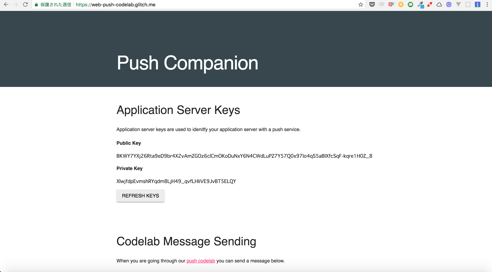
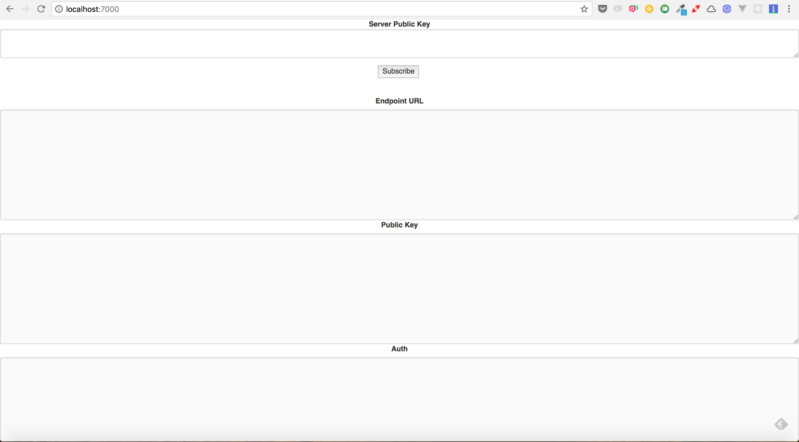
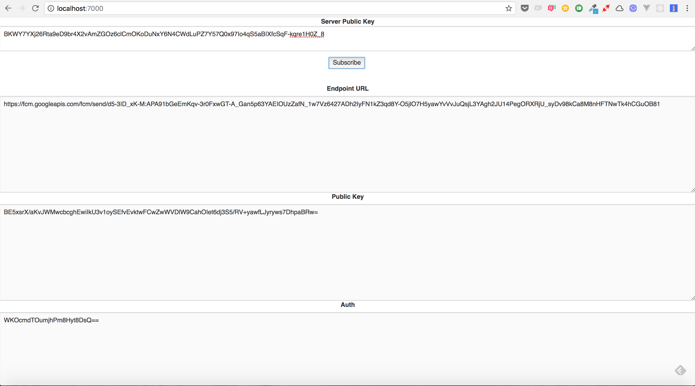
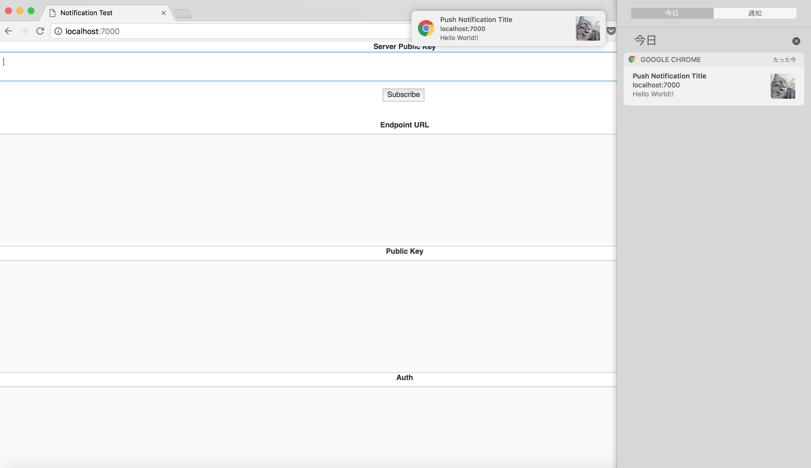

# web-push
This is a sample of Progressive Web Apps that notifies in accordance with the specification of [VAPID](https://developers.google.com/web/ilt/pwa/introduction-to-push-notifications#using_vapid).

## Getting Started
This project requires Docker. Install from [here](https://docs.docker.com/engine/installation/#supported-platforms).

### Create key pair
Create a key pair for application server from [Push Companion](https://web-push-codelab.glitch.me/).



### Access page
Run the following command.

```

$ docker-compose up --build -d

```

Access in the browser by navigating to [http://localhost:7000](http://localhost:7000).



### Get subscriptions
After accessing the page, paste the public key created from the Push Companion into textarea of Server Public Key and click the subscribe button.
Subscriptions (Endpoint URL, Public Key, Auth) is shown on the page.



### Create config file
Create a config file (```notification/src/config/default.json```).

```json:default.json

{
    "server": {
        "publicKey": "<SERVER_PUBLIC_KEY_FROM_PUSH_COMPANION>",
        "authKey": "<SERVER_PRIVATE_KEY_FROM_PUSH_COMPANION>"
    },
    "client": {
        "publicKey": "<CLIENT_PUBLIC_KEY_FROM_PAGE>",
        "auth": "<CLIENT_AUTH_FROM_PAGE>",
        "endpoint": "<CLIENT_ENDPOINT_FROM_PAGE>"
    }
}

```

### Notifiation
Notification is shown by runnning the following command.

```

$ docker-compose start notification

```

